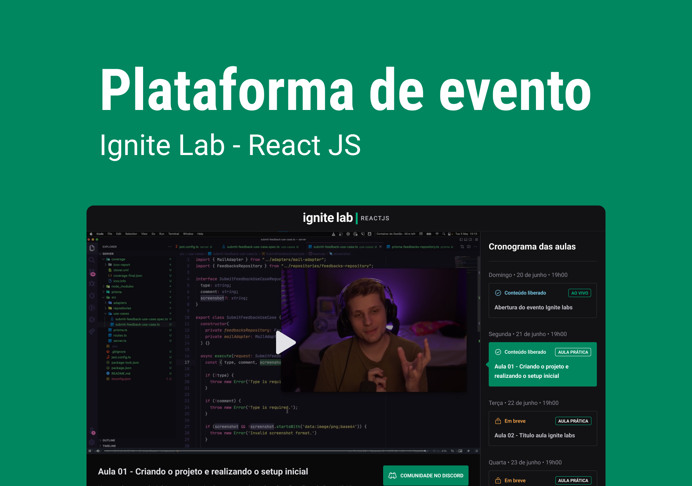
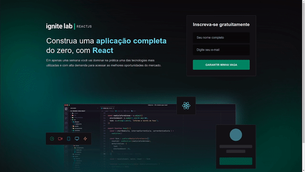

  <a href="#-tecnologias">Tecnologias</a>&nbsp;&nbsp;&nbsp;|&nbsp;&nbsp;&nbsp;
  <a href="#-projeto">Projeto</a>&nbsp;&nbsp;&nbsp;|&nbsp;&nbsp;&nbsp;
  <a href="#-layout">Layout</a>&nbsp;&nbsp;&nbsp;|&nbsp;&nbsp;&nbsp;
  <a href="#memo-licença">Licença</a>

 

 

 

  

## 🚀 Tecnologias

Esse projeto foi desenvolvido com as seguintes tecnologias:

- HTML
- Tailwind CSS
- JavaScript
- ReactJS
- Apollo Client
- GraphQL
- GraphCMS
- Vime

## 💻 Projeto

O projeto é uma plataforma de conteúdos em vídeo com uma home page de cadastro, insira alguma informação na página de cadastro para poder seguir para a página onde estão as aulas. Você pode acessar o site por <a href="https://ignite-lab-react-ijknrjvae-tysonoliveira.vercel.app/" target="_blanck">este link</a>.

  

---

## 🔖 Layout 

Você pode visualizar o layout do projeto através [desse link](https://www.figma.com/community/file/1120711251998877938). É necessário ter conta no [Figma](https://figma.com) para acessá-lo.

## Contatos

---

Feito com ❤️ by Thaison Oliveira 

